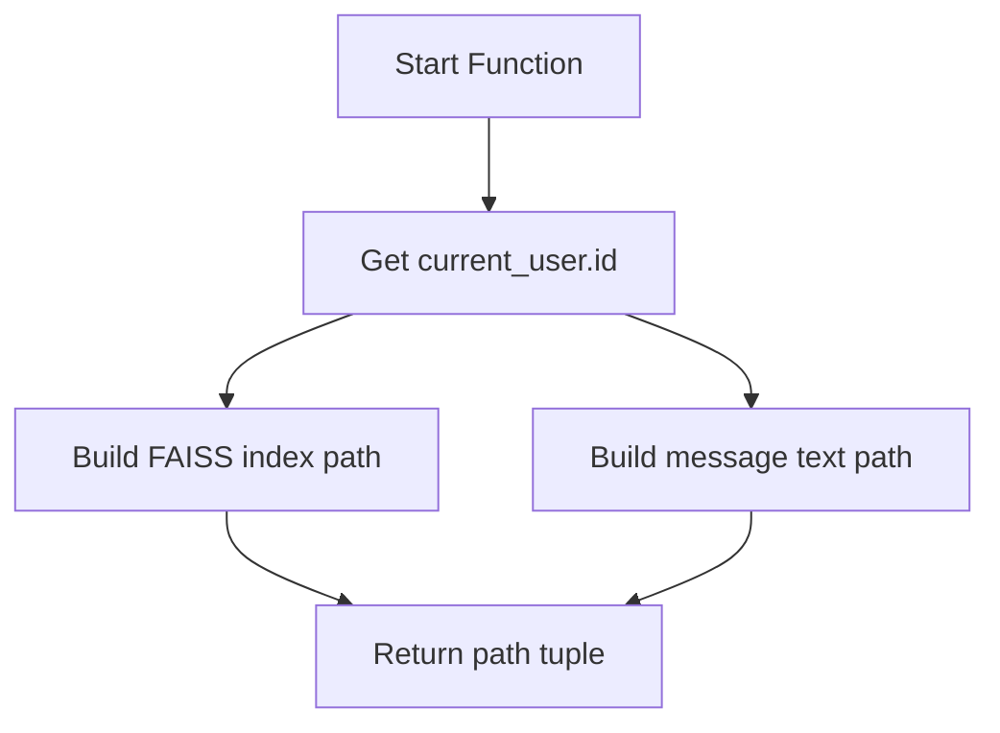
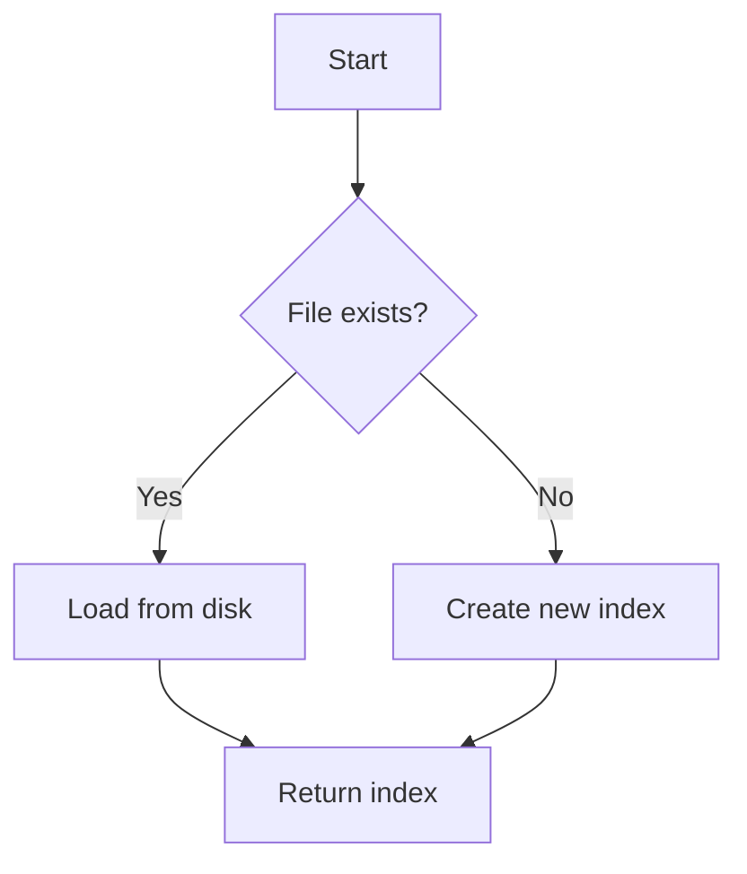
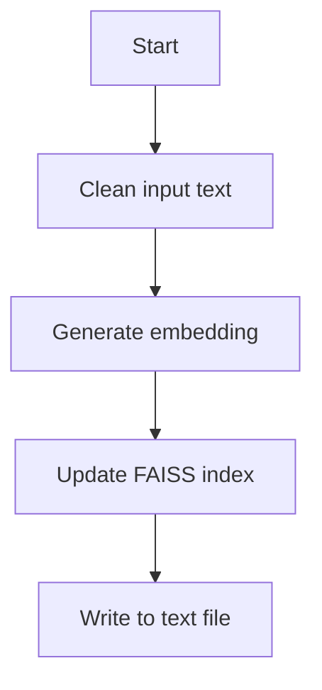
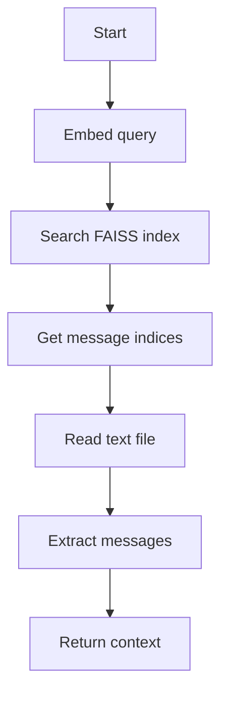
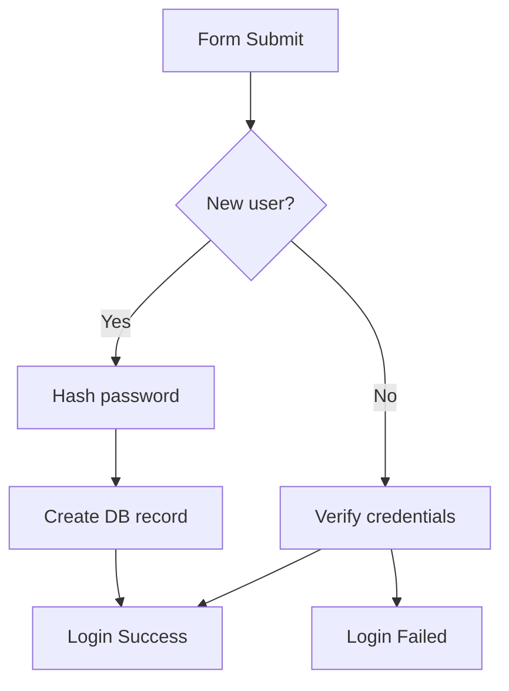
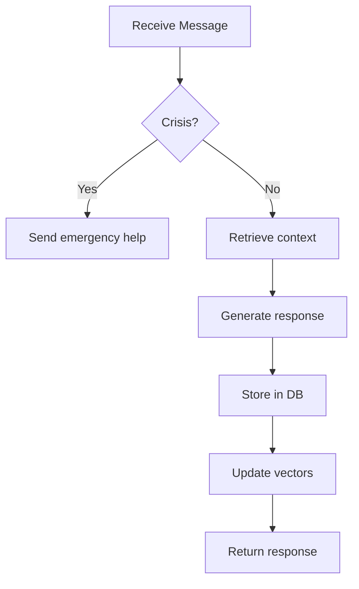
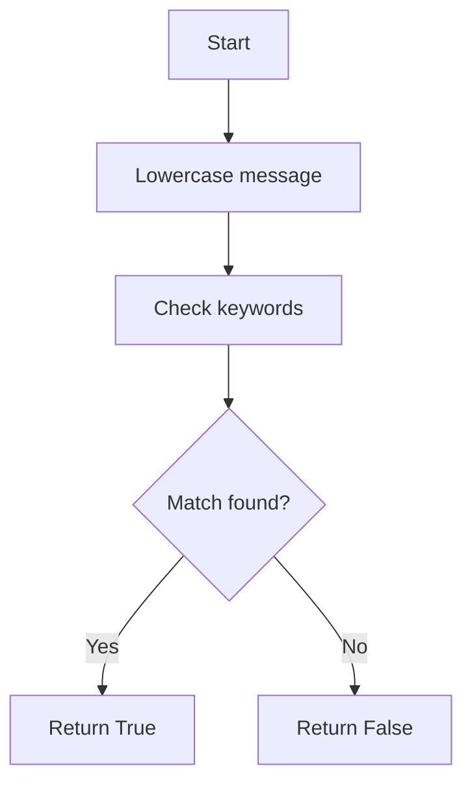
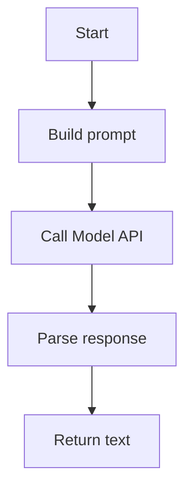
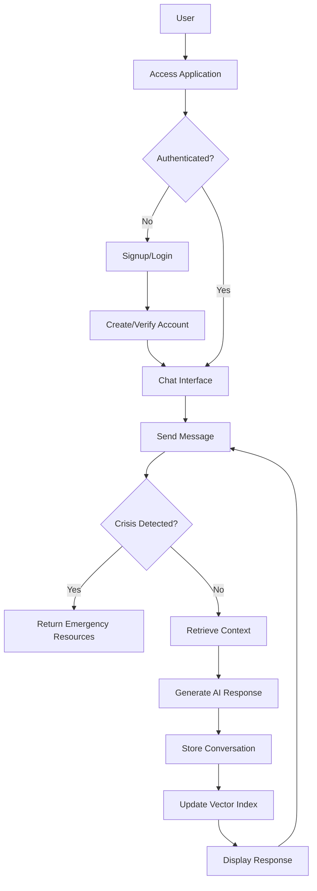
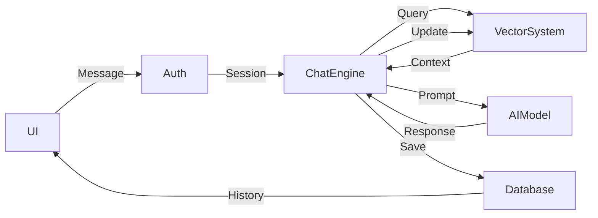

# Echo Care
Echo care, a mental health chatbot that's less of a robot and more of a talking, listening and supportive journal.
Python version used in development: 3.12.6

## Prerequisites:
### MongoDB Community Edition
1. **Download MongoDB**  
   Visit the [MongoDB Community Download page](https://www.mongodb.com/try/download/community) and choose the package for your operating system.

2. **Install MongoDB**  
   - **Windows**: Run the downloaded `.msi` installer and follow the prompts.  
   - **macOS** (using Homebrew):  
     ```bash
     brew tap mongodb/brew
     brew install [email protected]
     brew services start [email protected]
     ```  
     *(Ensure you have Homebrew installed.)*  
   - **Linux (Ubuntu example)**:  
     ```bash
     # Import the public key
     curl -fsSL https://www.mongodb.org/static/pgp/server-8.0.asc | sudo apt-key add -
     
     # Create the list file (adjust 'focal' for your Ubuntu release)
     echo "deb [ arch=amd64,arm64 signed-by=/usr/share/keyrings/mongodb-server-8.0.gpg ] https://repo.mongodb.org/apt/ubuntu focal/mongodb-org/8.0 multiverse" | sudo tee /etc/apt/sources.list.d/mongodb-org-8.0.list
     
     # Update packages and install
     sudo apt-get update
     sudo apt-get install -y mongodb-org
     
     # Start MongoDB
     sudo systemctl start mongod
     sudo systemctl enable mongod
     ```  
   *Refer to [MongoDB’s installation docs](citeturn0search2) for more details and adjustments per OS.*

3. **Verify Installation**  
   Open the MongoDB shell by running `mongo` (or use MongoDB Compass) to check that the server is running.

---

### Ollama
1. **Download and Install Ollama**  
   Ollama is available for macOS, Windows, and Linux:
   - **macOS**: Download the installer from [Ollama for macOS](https://ollama.com/download/mac) and drag the `Ollama.app` into your Applications folder.
   - **Windows**: Download the executable from [Ollama for Windows](https://ollama.com/download/windows) and run it.
   - **Linux**: Run the following command in your terminal:
     ```bash
     curl -fsSL https://ollama.com/install.sh | sh
     ```
   *(See Ollama’s download page) for more info.)*

2. **Verify Installation and Start Server**  
   Open a terminal (or CMD on Windows) and run:
   ```bash
   ollama --help
   ```
   Then start the Ollama server:
   ```bash
   ollama serve
   ```
   
3. **Pull and Test a Model (Optional)**  
   To download and test a model (e.g., Llama 3.2):
   ```bash
   ollama pull llama3.2
   ollama run llama3.2 "Hello, Ollama!"
   ```
---

## Setup:
1. Clone this repository by running in your working directory
   
   ```bash
   git clone https://github.com/SaiVignesh45/Echo-Care.git
   ```
   
   or download as ZIP and extract.

2. Install python version=3.12.6, create a virtual environment, make sure  that pip is installed, and install the dependencies using this command.
   ```bash
   pip install -r req.txt
   ```
3. Run app.py after all the pre-requisites are installed and running in the background.

## Code Components:

**1. get_user_files**  
   
1. Triggered when needing user-specific file paths  
2. Retrieves current_user.id from active session  
3. Constructs FAISS index path: `faiss_indexes/faiss_index_{user_id}.index`  
4. Constructs message store path: `messages/message_store_{user_id}.txt`  
5. Returns tuple (index_path, text_path)  



---

**2. load_faiss_store**  
   
1. Called when initializing chat session  
2. Checks if FAISS index file exists for user  
3. If exists: Loads binary index file using faiss.read_index()  
4. If missing: Creates new empty IndexFlatL2 with EMBEDDING_DIM dimensions  
5. Returns initialized FAISS index object  



---

**3. store_vector_message**  
   
1. Receives message text, role (user/bot), and FAISS index  
2. Cleans text by removing extra whitespace  
3. Generates embedding using OllamaEmbeddings  
4. Adds embedding vector to FAISS index  
5. Appends raw text to message store file with role prefix  



---

**4. retrieve_context**  
   
1. Takes user query and FAISS index as input  
2. Generates query embedding using OllamaEmbeddings  
3. Performs FAISS similarity search for top_k neighbors  
4. Reads message store text file  
5. Extracts messages at found indices  
6. Joins messages into context string  
7. Returns concatenated context  



---

**5. User Authentication Flow**  
   
1. User submits credentials via form  
2. System checks MongoDB for username  
3. If new user: Hashes password with bcrypt and creates record  
4. If existing user: Verifies password hash  
5. On success: Creates Flask-Login session  
6. On failure: Returns error message  



---

**6. chat Endpoint**  
   
1. Receives POST request with user message  
2. Checks for crisis keywords using detect_crisis()  
3. If crisis detected: Returns emergency response template  
4. Else: Loads FAISS index and retrieves context  
5. Formats prompt with context and system instructions  
6. Calls Ollama API with formatted prompt  
7. Stores conversation in MongoDB  
8. Updates FAISS index with new messages  
9. Returns generated response  



---

**7. detect_crisis**  
   
1. Converts message to lowercase  
2. Iterates through CRISIS_KEYWORDS list  
3. Checks if any keyword exists in message  
4. Returns True if match found, False otherwise  



---

**8. generate_response**  
   
1. Combines system prompt and retrieved context  
2. Formats full prompt template:  
   ```
   Previous messages: {context}  
   User: {input}  
   Chatbot:  
   ```  
3. Sends prompt to Ollama chat completions API  
4. Parses API response for message content  
5. Returns cleaned response text  



---

### **Overall Workflow**  
**1. User Access**  
- User visits application URL  
- Redirected to login/signup page if unauthenticated  

**2. Authentication**  
- *New Users*:  
  1. Submit signup form  
  2. System hashes password with bcrypt  
  3. Creates MongoDB user record  
  4. Redirects to login  
- *Existing Users*:  
  1. Submit login credentials  
  2. System verifies password hash  
  3. Creates Flask-Login session  

**3. Chat Interaction**  
1. User submits message via UI  
2. System immediately checks for crisis keywords:  
   - **If crisis detected**: Returns emergency resources template  
   - **If safe**: Proceeds with normal processing  

**4. Context Retrieval**  
1. Loads user-specific FAISS index  
2. Generates embedding for current message  
3. Performs similarity search on historical vectors  
4. Retrieves relevant context from message store  

**5. Response Generation**  
1. Formats prompt with:  
   - System instructions (SUPPORTIVE_PROMPT)  
   - Retrieved context  
   - Current message  
2. Calls Ollama API with formatted prompt  
3. Processes AI response  

**6. Data Storage**  
1. Stores conversation in MongoDB:  
   - User ID  
   - Timestamp  
   - Message/response pair  
2. Updates FAISS index with new embeddings  
3. Appends raw text to message store file  

**7. Response Delivery**  
- Returns formatted response to UI  
- Updates chat history display  




---

##**Data Flow**:  



1. **User** initiates session through browser  
2. **Flask** handles routing and template rendering  
3. **MongoDB** persists:  
   - User credentials (bcrypt hashed)  
   - Timestamped chat history  
4. **FAISS** + Text Files maintain:  
   - Conversation embeddings for context  
   - Raw message history for retrieval  
5. **Ollama** processes:  
   - Crisis detection bypass logic  
   - Context-aware response generation  
6. **Security** ensured through:  
   - Session management (Flask-Login)  
   - Password hashing (bcrypt)  
   - User-specific data isolation  

---


## Credits
### - Sai Vignesh 
GitHub: @saivignesh45

Mail: saivignesh742@gmail.com

### - Gokulramanan 
GitHub: @Feininon 

Mail: gokulramananvec@gmail.com
